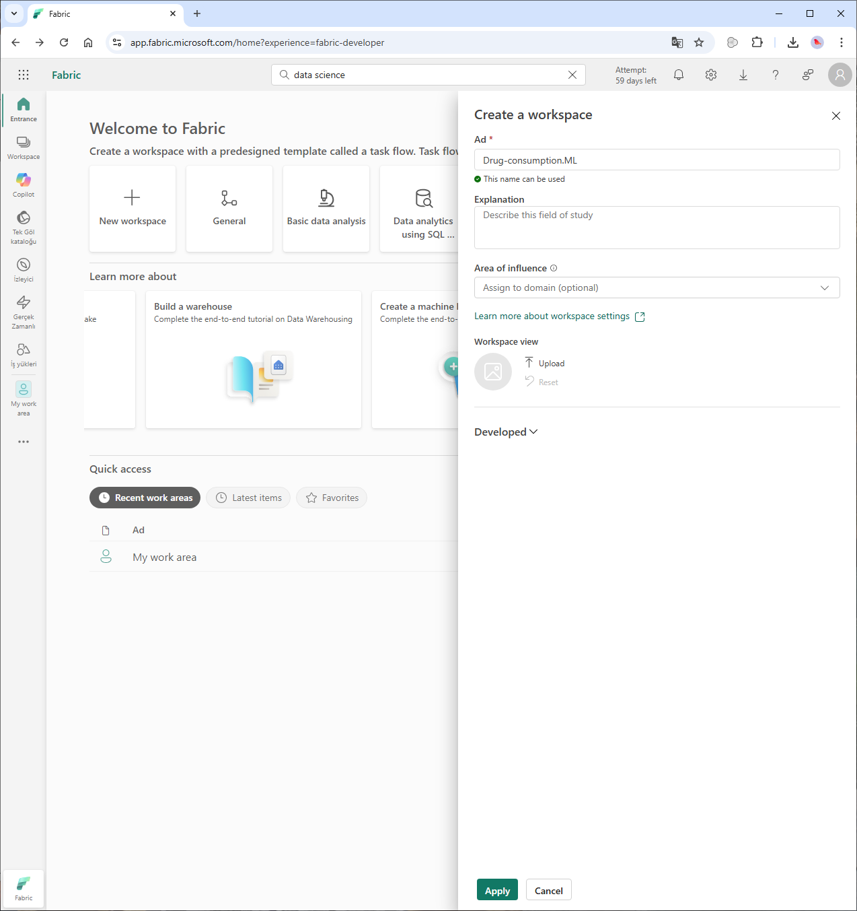
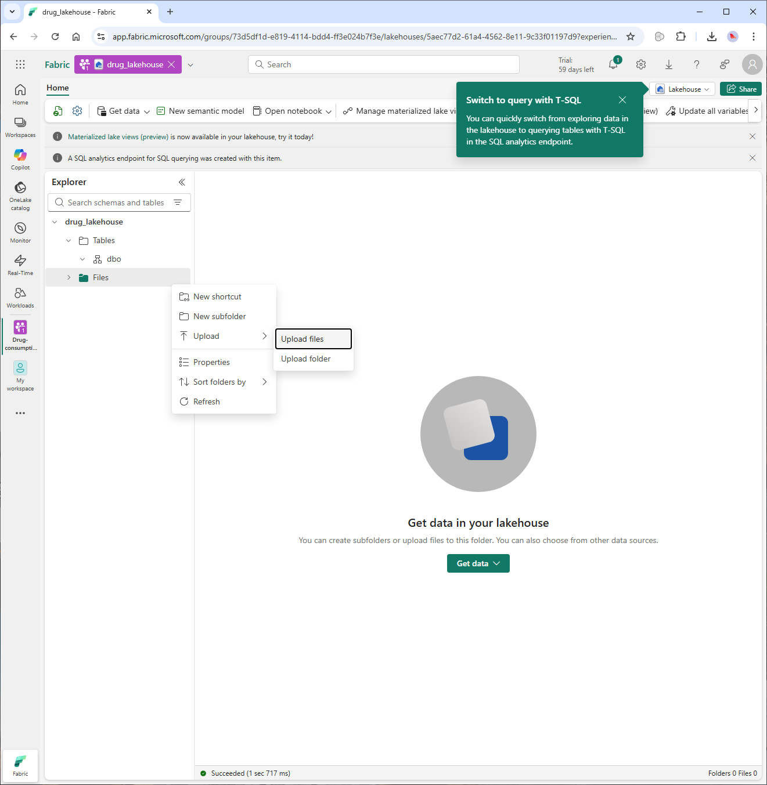
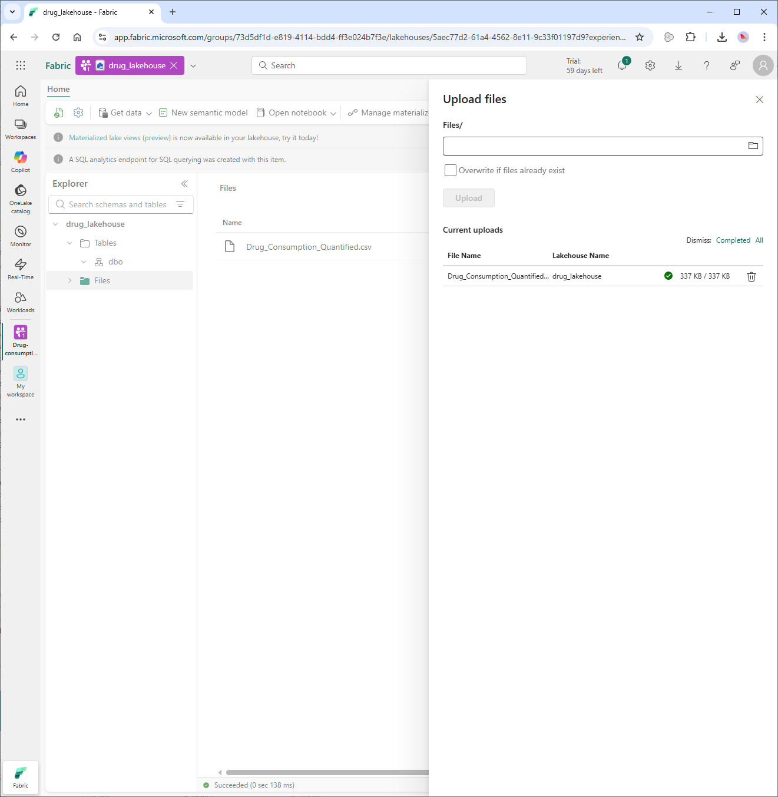
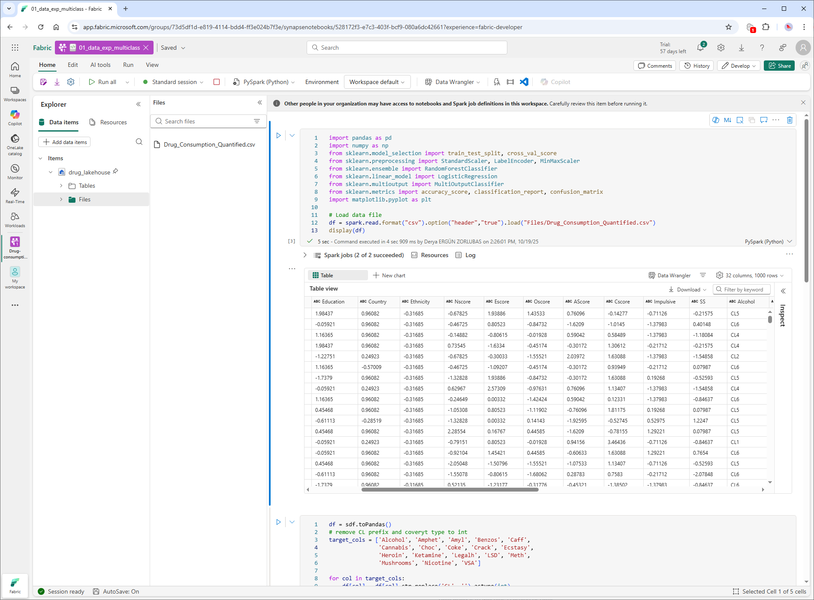
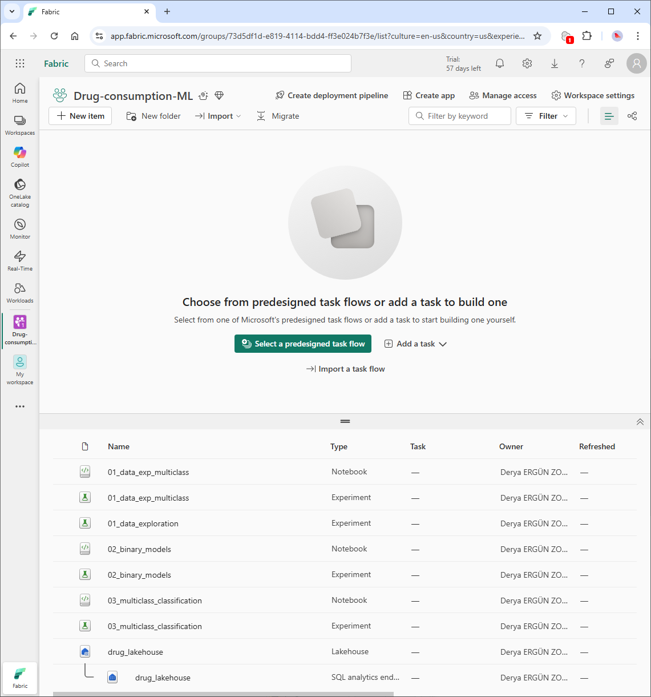
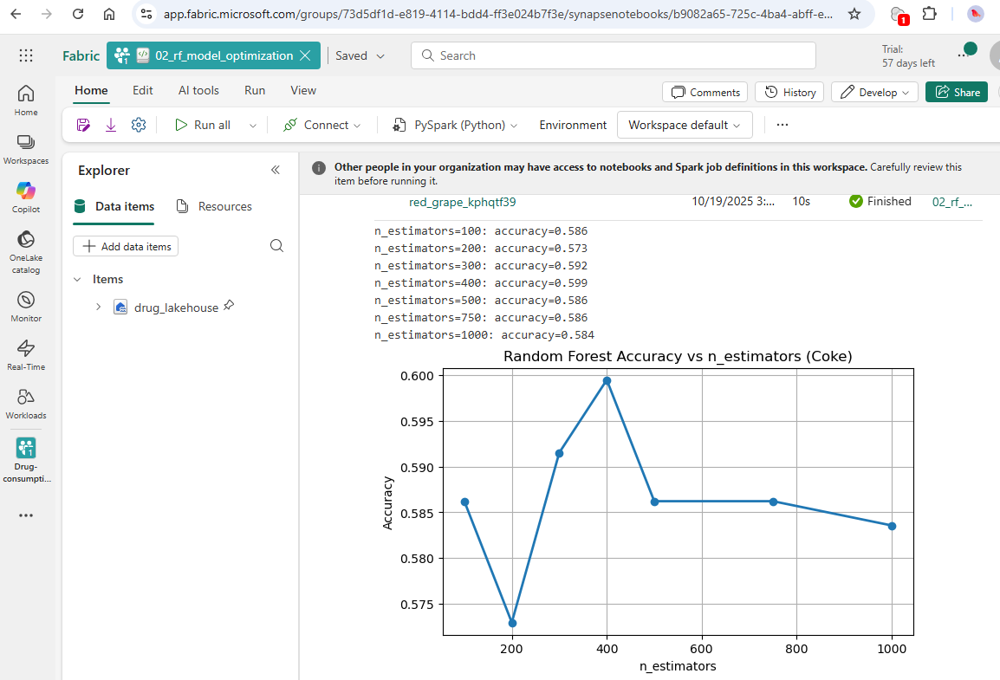
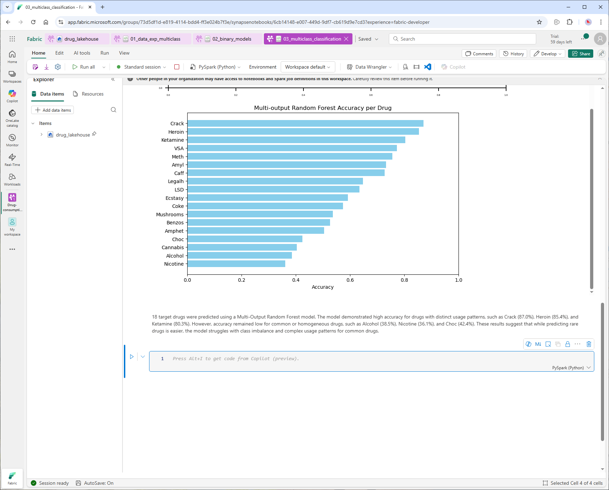

# Building Multiclass and Binary Classification Models on Microsoft Fabric

## 1.  Project Overview
The purpose of this project is to analyze the Drug Consumption (Quantified) dataset on https://archive.ics.uci.edu/dataset/373/drug+consumption+quantified and build machine learning models to predict individual drug usage patterns based on demographic and psychological features.

This project focuses on analyzing and predicting drug consumption patterns based on psychological and demographic attributes using machine learning models.  
The dataset includes 18 types of drugs, where consumption frequency is encoded as ordinal categorical values (CL0–CL6). The goal is to predict the likelihood or class of consumption for each drug.

This project demonstrates applied skills in:
- Data preprocessing and feature transformation using pandas
- Multiclass and multi-output classification using scikit-learn
- Model comparison and performance evaluation with Logistic Regression and Random Forest

All experiments were executed within the **Microsoft Fabric** environment, using **Lakehouse** for data storage and **Python Notebooks** for machine learning workflows.


## 2. Dataset Overview
- **Dataset:** Drug Consumption (18 output features, 12 input features)
- **Input Features:** Age, Gender, Education, Country, Ethnicity, Nscore, Escore, Oscore, Ascore, Cscore, Impulsive, SS  
- **Output Features (Drugs):** Alcohol, Amphet, Amyl, Benzos, Caff, Cannabis, Choc, Coke, Crack, Ecstasy, Heroin, Ketamine, Legalh, LSD, Meth, Mushrooms, Nicotine, VSA  
- The original data labels (CL0–CL6) were converted to integer values (0–6) for modeling.

The dataset already includes ordinal encoding for each drug feature using labels CL0–CL6, representing increasing levels of recent drug use (from “Never Used” to “Used in Last Day”). Therefore, no additional encoding such as one-hot encoding was required, since the variables are already in numeric ordinal form after removing the CL prefix. However, if this encoding had not been applied in advance, Microsoft Fabric’s Data Wrangler functionality could have been used to perform the necessary data transformations.
  CL0 → “Never Used”
CL1 → “Used in Last Decade”
CL2 → “Used in Last Year”
CL3 → “Used in Last Month”
CL4 → “Used in Last Week”
CL5 → “Used in Last Day”
CL6 → “Used in Last 24 Hours”


## 3. Implementation in Microsoft Fabric

### Fabric Environment Setup
- Created a new Fabric workspace.  
  **Workspace Name:** `Drug-consumptionML`  
<p align="center">
    
</p>

- Added a Lakehouse and uploaded the dataset (`drug_consumption.csv`).  
<p align="center">
    
</p>
- Accessed the dataset through the Lakehouse “Files” section.
<p align="center">
    
</p>

### Fabric User Interface Overview
- The left panel provides access to Lakehouse, Notebooks, Dataflows, and ML Models.  
<p align="center">
    
</p>
- The “Notebooks” interface supports both PySpark and Pandas workflows.  
- The “Data” tab displays uploaded files and generated tables.
<p align="center">
    
</p>

---

## 4. Data Preparation

The dataset was processed using **pandas**. Main steps included:
- Removing the `CL` prefix from target columns.  
- Converting target columns to integer values.  
- Scaling numeric features using StandardScaler.  
- Splitting data into training and testing sets.

---

## 5. Model Design and Implementation

### Part A – Multiclass Classification (2 Drugs)
**Models:** Logistic Regression and Random Forest  

**Results:**  
- Logistic Regression (Cannabis): 0.416  
- Logistic Regression (Coke): 0.568  
- Random Forest (Cannabis): 0.414  
- Random Forest (Coke): 0.581  

**Interpretation:**  
Coke classification achieved slightly higher accuracy than Cannabis. Random Forest performed marginally better overall, though both models showed limited predictive power, suggesting that drug use behavior is not easily separable using only demographic and psychological features.

---

### Part B – Parameter Optimization (Random Forest)
**Parameter tested:** `n_estimators`  

**Results:**  
`n_estimators=100 → 0.586`, `200 → 0.573`, `300 → 0.592`, `400 → 0.599`, `500 → 0.586`, `750 → 0.586`, `1000 → 0.584`

**Interpretation:**  
Accuracy improved slightly up to 400 estimators, then stabilized, indicating that higher tree counts did not significantly enhance performance. This suggests that model complexity beyond a certain point yields diminishing returns.
<p align="center">
    
</p>
---

### Part C – Multi-Output Classification (18 Drugs)
**Model:** MultiOutputClassifier with Random Forest base model (`n_estimators=200`)  

**Top Accuracies:** Crack (0.870), Heroin (0.854), Ketamine (0.804)  
**Lowest Accuracies:** Alcohol (0.385), Nicotine (0.361)
<p align="center">
    
</p>

**Interpretation:**  
The model performed well for drugs with distinct usage patterns (e.g., Crack, Heroin), while commonly used substances like Alcohol and Nicotine were harder to classify. This implies that extreme behaviors are easier to distinguish from demographic and personality traits, whereas moderate or socially accepted drug use shows greater overlap among users.

---

## 6. Discussion and Insights

Random Forest generally outperformed Logistic Regression. Class imbalance affected accuracy for rare drugs. Psychological traits like *Sensation Seeking* and *Impulsivity* were linked to higher use likelihood.

Random Forest was chosen for its ability to capture complex, nonlinear relationships and effectively model interactions between variables.  
Logistic Regression (Multinomial) provided a simpler and interpretable benchmark for evaluating model performance improvements.

---

## 7. Conclusion

The project successfully demonstrated multiclass and multi-output classification for 18 drugs. Future work may include boosted models (XGBoost), class-weighting, and deployment in Microsoft Fabric MLflow.

---

## 8. Implementation Summary

1. Created a Lakehouse in Microsoft Fabric.  
2. Uploaded the dataset under *Files/drug_consumption.csv*.  
3. Imported it using pandas.  
4. Processed and modeled the data with scikit-learn.  
5. Visualized results within Fabric Notebooks.

---

## Project File Paths

```
Drug_Consumption_Project/
│
├── README.md
├── Files/
│   └── Drug_Consumption_Quantified.csv        
├── notebooks/
│   ├── 01_data_exp_multiclass.ipynb
│   ├── 02_rf_model_optimization.ipynb
│   ├── 03_multiclass_classification.ipynb
└── src/
    └── drug_classification.py
```
